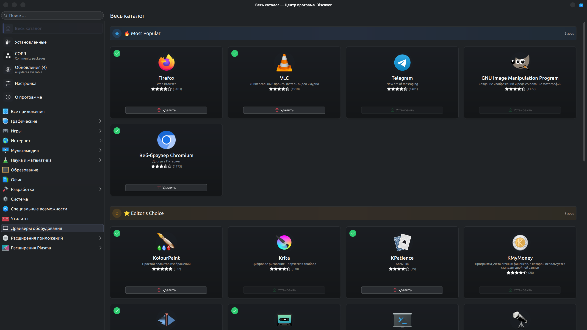
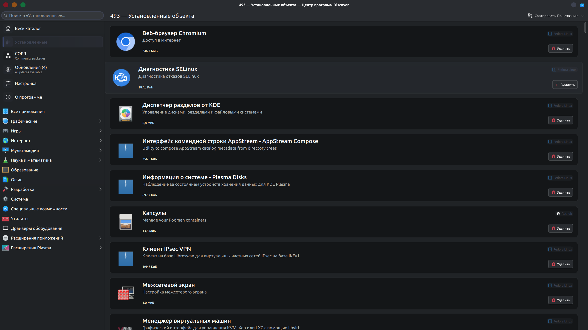
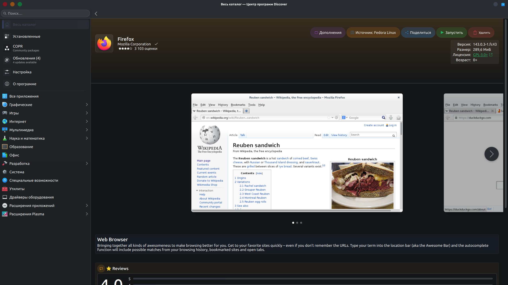
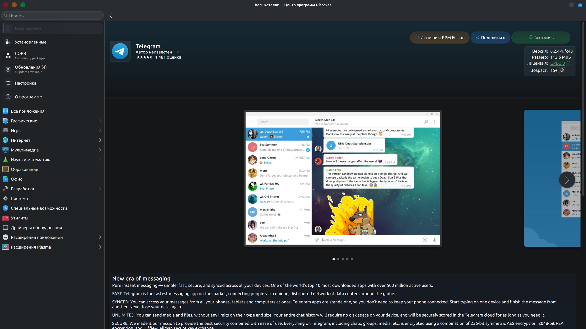
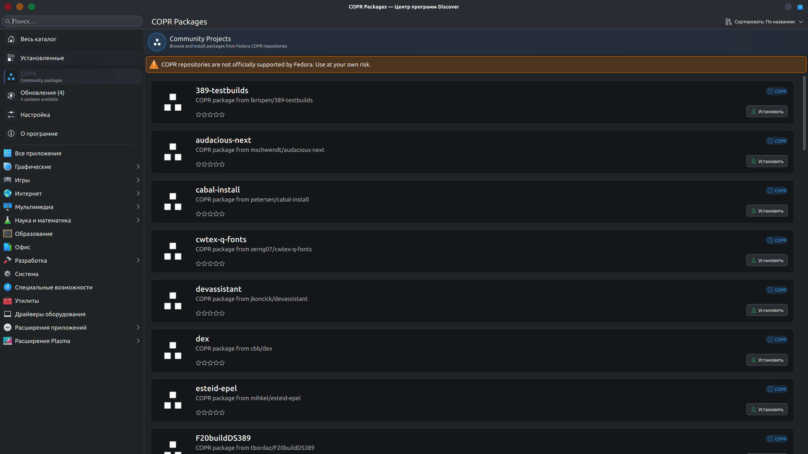
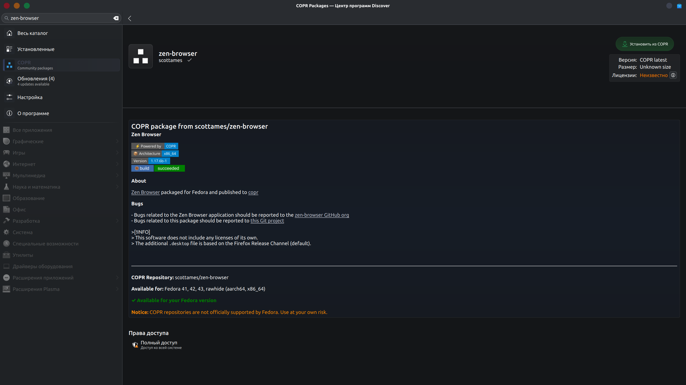

# Discover Plus

Enhanced KDE Discover with extended RPM package support and COPR integration for Fedora Linux.

## Screenshots

<details>
<summary><b>Click to view UI Gallery</b></summary>

### Main Interface
<p align="center">
  
  
</p>

### Updates & Package Management
<p align="center">
  
  
</p>

### Settings & COPR Integration
<p align="center">
  
  
</p>

### Browse & Search
<p align="center">
  
</p>

</details>

## Modern UI Redesign

> **Note:** The modern UI redesign is available in the `ui-redesign` branch.
> To use it: `git checkout ui-redesign`

The redesigned interface features:
- **Modern Cards** - Application cards with gradients, shadows, and smooth hover effects
- **Enhanced Visual Feedback** - Animated transitions and interactive elements
- **Clean Updates Page** - Simplified layout without cluttered section headers
- **Styled Action Buttons** - Color-coded buttons with gradient backgrounds
- **Improved Spacing** - Better content distribution and readability

## Key Features

* **COPR Repository Integration** - Browse and install packages from Fedora COPR (Community Projects)
* **Full RPM Fusion Support** - All RPM Fusion packages are now visible in Discover
* **Enhanced Package Search** - Fallback search via PackageKit for packages without AppStream metadata
* **Repository Labels** - Shows repository source for each package (Fedora Linux, RPM Fusion, COPR, etc.)
* **Proper Icons** - Uses package-specific icons instead of generic ones
* **Fixed UI Layout** - Install button consistently positioned regardless of rating presence

## What's New

### COPR Integration
* New COPR category in the sidebar
* Search and browse COPR packages directly in Discover
* Automatic pagination when scrolling
* Smart relevance-based search results
* Markdown to HTML description conversion
* One-click install with automatic repository enabling
* Clean uninstall with repository removal
* Launch button for installed applications

## Installation

### Quick Install (Recommended)

```bash
chmod +x install.sh
./install.sh
```

The script will automatically:
- Remove conflicting system packages
- Install all dependencies
- Build and install Discover Plus

### Manual Installation

<details>
<summary>Click to expand manual steps</summary>

#### Dependencies

```bash
sudo dnf install -y cmake extra-cmake-modules gcc-c++ kf6-kconfig-devel kf6-kcoreaddons-devel kf6-kcrash-devel kf6-kdbusaddons-devel kf6-ki18n-devel kf6-karchive-devel kf6-kxmlgui-devel kf6-kio-devel kf6-kcmutils-devel kf6-kidletime-devel kf6-purpose-devel kf6-kiconthemes-devel kf6-kstatusnotifieritem-devel kf6-kauth-devel kf6-knotifications-devel kf6-kirigami-devel kf6-kirigami-addons-devel PackageKit-Qt6-devel appstream-qt-devel qcoro-qt6-devel qt6-qtbase-devel qt6-qtdeclarative-devel qt6-qtwebview-devel flatpak-devel fwupd-devel libmarkdown-devel
```

#### Remove conflicting packages

```bash
sudo dnf remove -y plasma-discover plasma-discover-flatpak plasma-discover-snap plasma-discover-packagekit plasma-discover-libs
```

#### Build

```bash
mkdir build
cd build
cmake .. \
    -DCMAKE_INSTALL_PREFIX=/usr \
    -DCMAKE_BUILD_TYPE=RelWithDebInfo \
    -DBUILD_TESTING=OFF \
    -DBUILD_FlatpakBackend=ON \
    -DBUILD_PackageKitBackend=ON \
    -DBUILD_FwupdBackend=ON \
    -DBUILD_SnapBackend=ON \
    -DBUILD_AlpineApkBackend=ON \
    -DBUILD_DummyBackend=OFF \
    -DBUILD_RpmOstreeBackend=OFF \
    -DBUILD_SteamOSBackend=OFF \
    -DBUILD_WITH_QT6=ON
make -j$(nproc)
```

#### Install

```bash
sudo make install
```

</details>

### Debug

```bash
clear && QT_LOGGING_RULES="org.kde.plasma.libdiscover*.debug=true" plasma-discover
```

## Technical Details

### Repository Mapping

- `fedora`, `updates`, `updates-testing` → "Fedora Linux"
- `rpmfusion-*` → "RPM Fusion"
- `@copr:*`, `copr:*` → "COPR"
- Other repositories displayed as-is (e.g., "google-chrome")

### AppStream Pool Flags

The following flags are used:
- `FlagLoadOsCatalog` - Load system application catalog
- `FlagLoadOsDesktopFiles` - Load .desktop files
- `FlagLoadOsMetainfo` - Load meta information

## Support

For questions and bug reports, please use GitHub Issues.

## Original Discover

This project is based on KDE Discover. Original project: https://invent.kde.org/plasma/discover

## Building (Original)

The easiest way to make changes and test Discover during development is to [build it with kde-builder](https://community.kde.org/Get_Involved/development).

## Vendor Customization

Want to change the apps featured in the Editor's Choice section? Add a configuration file named `/usr/share/discover/featuredurlrc` that points to a JSON file patterned off the default one present at https://autoconfig.kde.org/discover/featured-5.9.json:
```toml
[Software]
FeaturedListingURL="https://your-url-here/file.json"
```

## Contributing

Like other projects in the KDE ecosystem, contributions are welcome from all. This repository is managed in [KDE Invent](https://invent.kde.org/plasma/discover), our GitLab instance.

* Want to contribute code? See the [GitLab wiki page](https://community.kde.org/Infrastructure/GitLab) for a tutorial on how to send a merge request.
* Reporting a bug? Please submit it on the [KDE Bugtracking System](https://bugs.kde.org/enter_bug.cgi?format=guided&product=Discover). Please do not use the Issues
  tab to report bugs.
* Is there a part of Discover that's not translated? See the [Getting Involved in Translation wiki page](https://community.kde.org/Get_Involved/translation) to see how
  you can help translate!

If you get stuck or need help with anything at all, head over to the [KDE New Contributors room](https://go.kde.org/matrix/#/#kde-welcome:kde.org) on Matrix. For questions about Discover, please ask in the [Plasma Discover room](https://go.kde.org/matrix/#/#plasma-discover:kde.org). See [Matrix](https://community.kde.org/Matrix) for more details.

