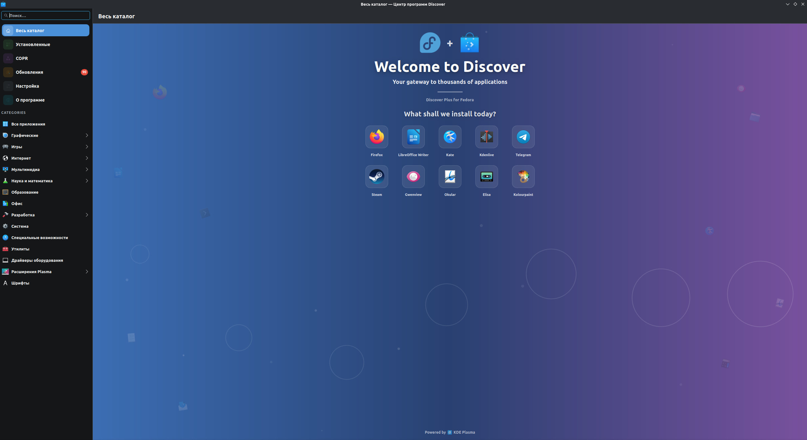
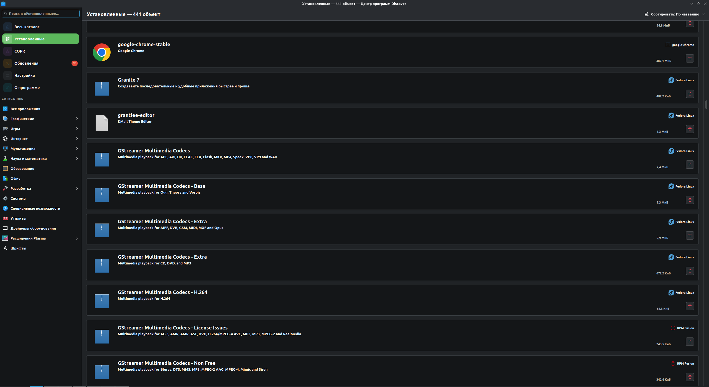
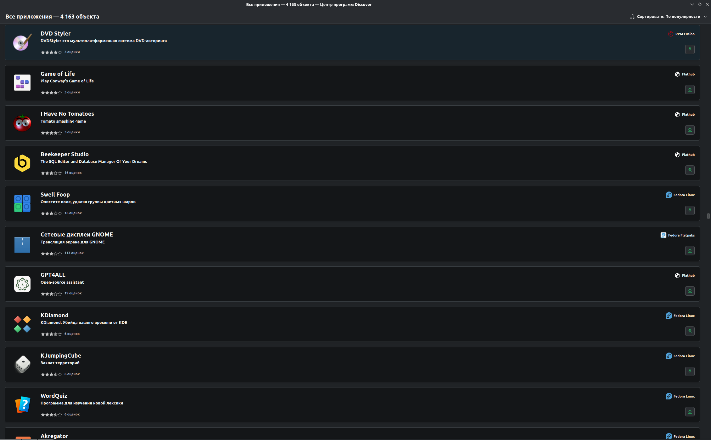
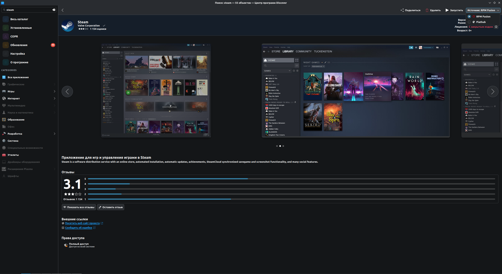
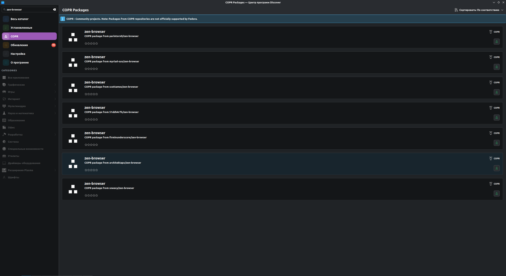
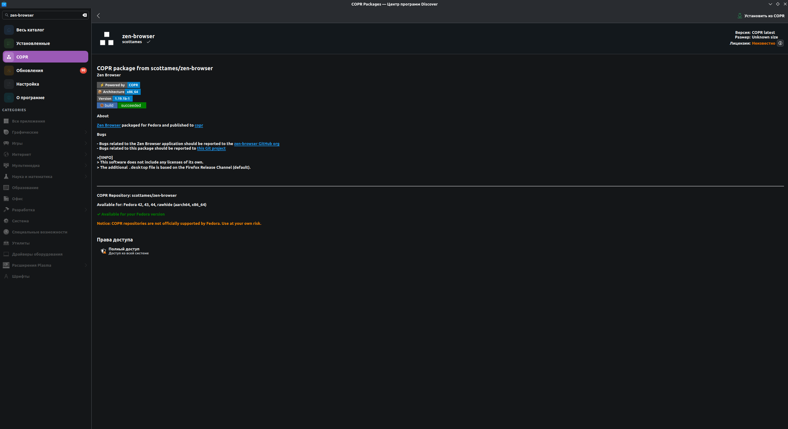
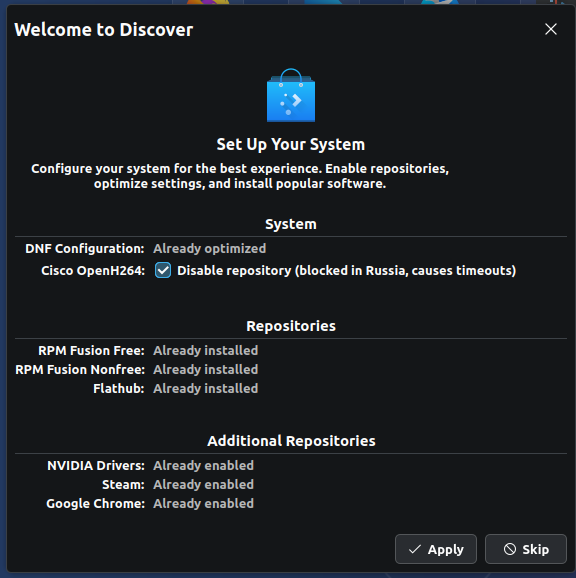
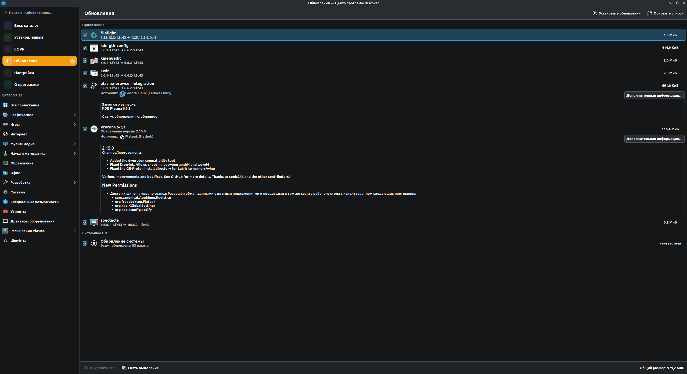

# Discover Plus

Discover Plus is a Fedora-focused fork of KDE Discover. It keeps the regular Discover UI and adds practical Fedora package workflows: RPM repositories, Flatpak sources, RPM Fusion, and Fedora COPR.

## Screenshots

<details>
<summary><b>UI gallery</b></summary>

### Home Page and Installed Apps
<p align="center">
  
  
</p>

### Repository Labels and Source Selection
<p align="center">
  
  
</p>

### COPR Search and Package Info
<p align="center">
  
  
</p>

### First-Run Setup and Updates
<p align="center">
  
  
</p>

</details>

## What This Fork Adds

- Fedora first-run setup for common repositories and DNF settings.
- RPM Fusion and Fedora package visibility through the PackageKit backend.
- Source labels for PackageKit and Flatpak results, including Fedora Linux, RPM Fusion, Fedora Flatpaks, Flathub, and COPR.
- Source-first sorting options: RPM Fusion first, Fedora Linux first, Fedora Flatpaks first, and Flathub first.
- Dedicated COPR page, search, project details, package selection, install, and uninstall.
- COPR detail UI with availability, build state, source metadata, repository flags, warnings, and instructions.
- Search history and PackageKit fallback results for packages without AppStream metadata.

## How It Works

### First-Run Setup

The first-run dialog is shown on Fedora systems and can configure:

- DNF parallel downloads, fastest mirror, and package cache behavior.
- RPM Fusion Free and Nonfree repositories.
- Flathub.
- Optional NVIDIA driver, Steam, and Google Chrome repositories.
- Cisco OpenH264 disablement, useful where that repository times out.

The setup runs the selected steps as one authenticated operation.

### Sources and Sorting

Discover Plus maps package origins into readable labels:

- `fedora`, `updates`, `updates-testing`: Fedora Linux
- `rpmfusion-*`: RPM Fusion
- Flatpak remotes containing `fedora`: Fedora Flatpaks
- Flatpak remotes containing `flathub`: Flathub
- `@copr:*` and `copr:*`: COPR

The sort menu can lift one selected source to the top of the current list. Changing sort order resets the old focused item and scroll position so the list stays at the top after sorting.

### COPR

COPR is intentionally handled from the COPR sidebar page, not from global search. This keeps regular app search fast and avoids mixing unreviewed COPR projects into normal results.

The COPR flow is:

1. Browse recent projects or search COPR from the COPR page.
2. Open a project page and review warnings, availability, build information, source links, repository flags, and instructions.
3. If the project exposes multiple packages, select the package to install.
4. Install enables the COPR repository and installs the selected package.
5. Uninstall removes the installed package and then removes the matching COPR repository.

COPR API responses are cached, duplicate requests are deduplicated, and concurrent requests are limited to keep the UI responsive.

## Installation

### Quick Install

```fish
chmod +x install.sh
./install.sh
```

The installer:

- Removes conflicting Fedora `plasma-discover` packages.
- Installs build dependencies with `dnf`.
- Builds the project.
- Installs it under `/usr`.
- Enables Discover offline updates in `/etc/xdg/discoverrc`.

Do not run `install.sh` as root. It asks for `sudo` only when needed.

### Manual Build

```fish
sudo dnf install -y cmake extra-cmake-modules gcc-c++ kf6-kconfig-devel kf6-kcoreaddons-devel kf6-kcrash-devel kf6-kdbusaddons-devel kf6-ki18n-devel kf6-karchive-devel kf6-kxmlgui-devel kf6-kio-devel kf6-kcmutils-devel kf6-kidletime-devel kf6-purpose-devel kf6-kiconthemes-devel kf6-kstatusnotifieritem-devel kf6-kauth-devel kf6-knotifications-devel kf6-kirigami-devel kf6-kirigami-addons-devel PackageKit-Qt6-devel appstream-qt-devel qcoro-qt6-devel qt6-qtbase-devel qt6-qtdeclarative-devel qt6-qtwebview-devel flatpak-devel fwupd-devel libmarkdown-devel

sudo dnf remove -y plasma-discover plasma-discover-flatpak plasma-discover-snap plasma-discover-packagekit plasma-discover-libs

cmake -S . -B build \
    -DCMAKE_INSTALL_PREFIX=/usr \
    -DCMAKE_BUILD_TYPE=RelWithDebInfo \
    -DBUILD_TESTING=OFF \
    -DBUILD_FlatpakBackend=ON \
    -DBUILD_PackageKitBackend=ON \
    -DBUILD_FwupdBackend=ON \
    -DBUILD_SnapBackend=ON \
    -DBUILD_AlpineApkBackend=ON \
    -DBUILD_DummyBackend=OFF \
    -DBUILD_RpmOstreeBackend=OFF \
    -DBUILD_SteamOSBackend=OFF \
    -DBUILD_WITH_QT6=ON

cmake --build build --parallel (nproc)
sudo cmake --install build
```

## Debug

```fish
clear; and env QT_LOGGING_RULES='org.kde.plasma.libdiscover*.debug=true' plasma-discover
```

Useful COPR log lines come from `org.kde.plasma.libdiscover.backend.packagekit`.

## Upstream

Discover Plus is based on KDE Discover: https://invent.kde.org/plasma/discover
