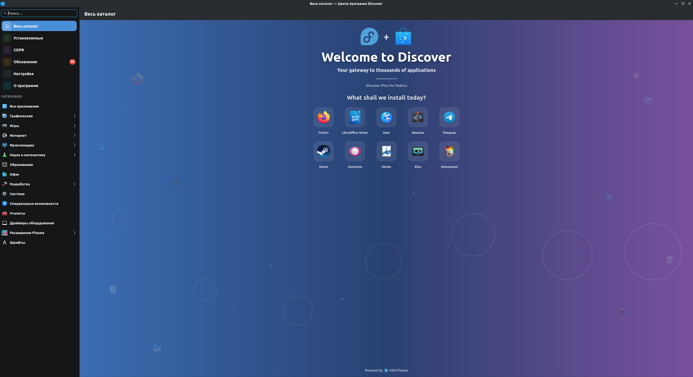
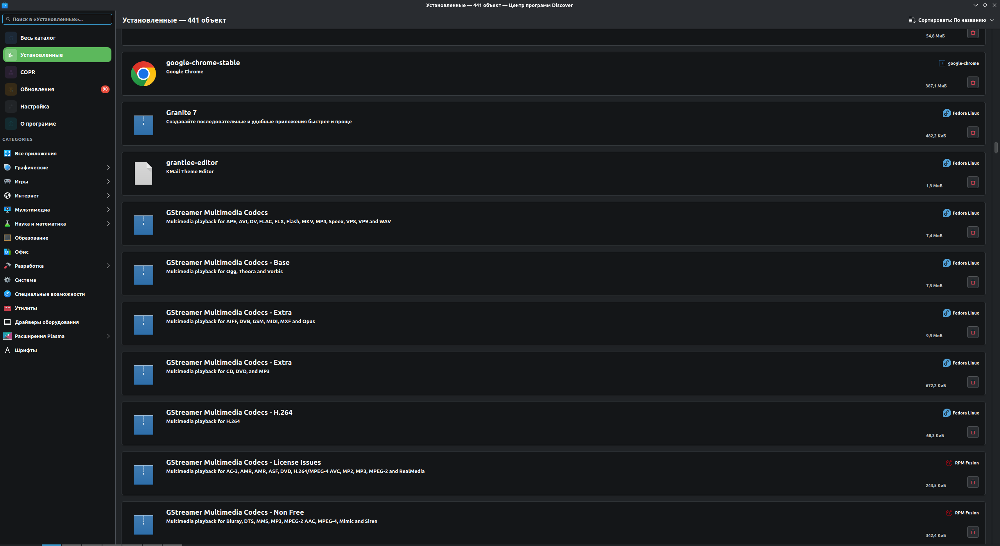
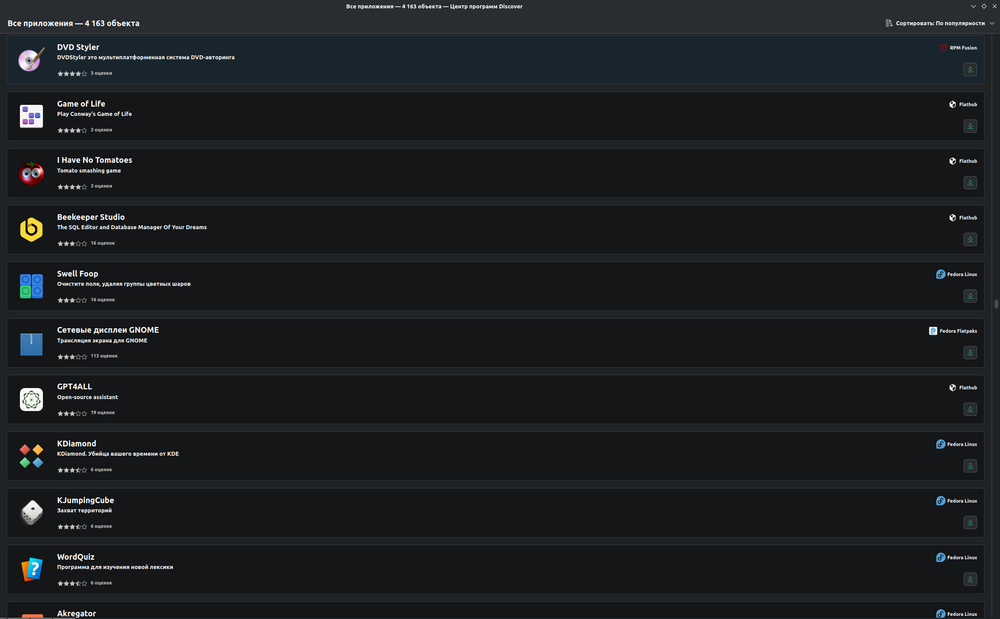
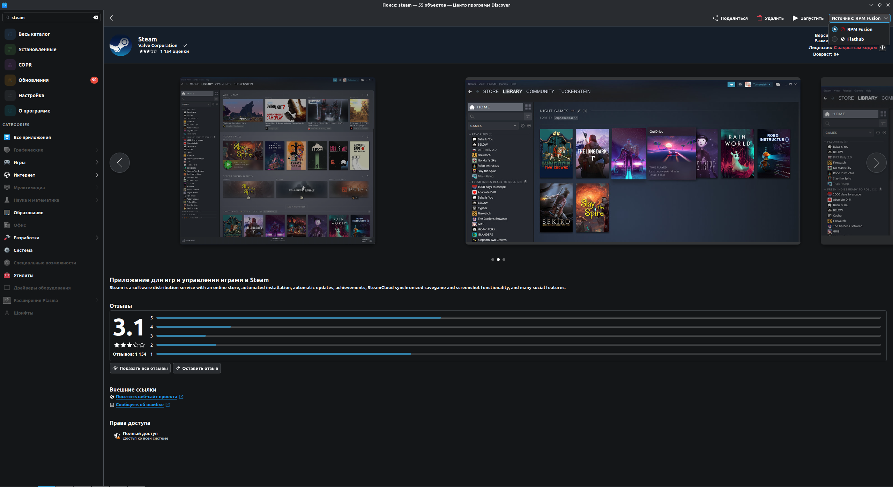
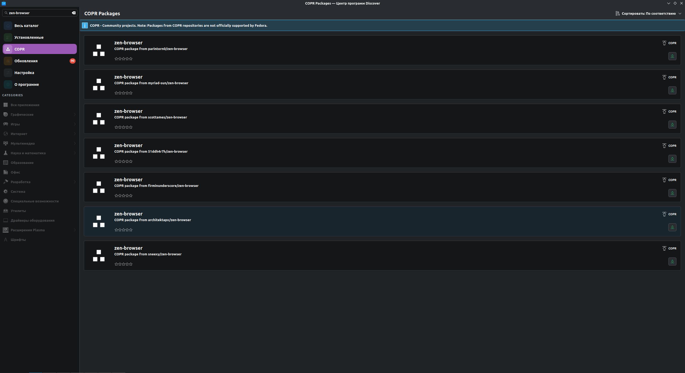
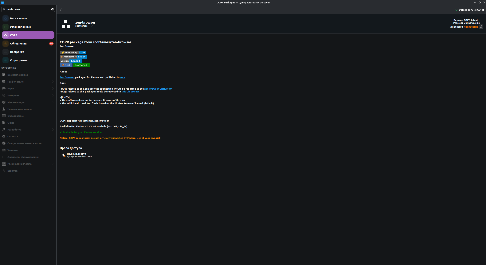
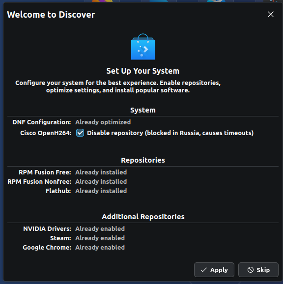
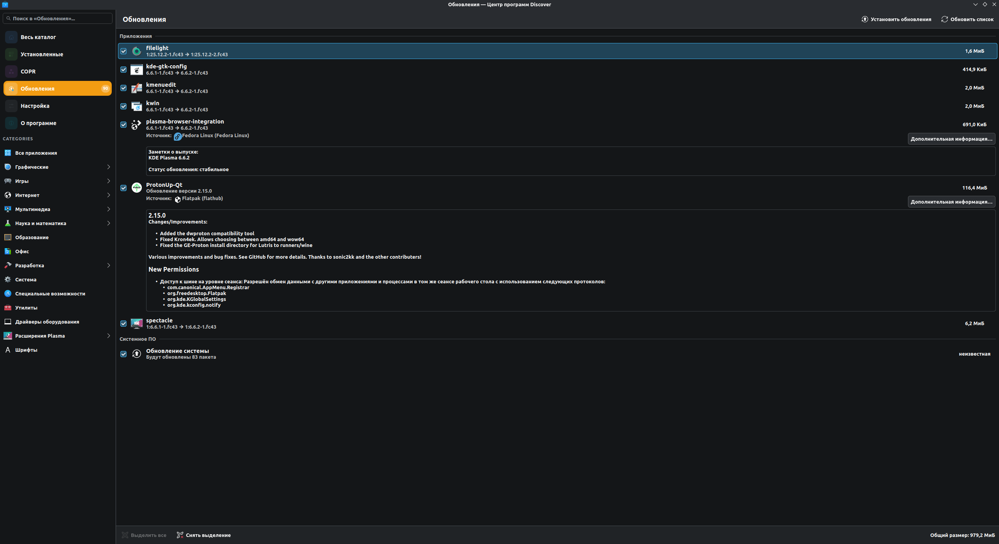

# Discover Plus

Discover Plus is a Fedora-focused fork of KDE Discover. It keeps the regular Discover UI and adds practical Fedora package workflows: RPM repositories, Flatpak sources, RPM Fusion, and Fedora COPR.

## Screenshots

<details>
<summary><b>UI gallery</b></summary>

### Home Page and Installed Apps
<p align="center">
  
  
</p>

### Repository Labels and Source Selection
<p align="center">
  
  
</p>

### COPR Search and Package Info
<p align="center">
  
  
</p>

### First-Run Setup and Updates
<p align="center">
  
  
</p>

</details>

## What This Fork Adds

- Fedora first-run setup for common repositories and DNF settings.
- RPM Fusion and Fedora package visibility through the PackageKit backend.
- Source labels for PackageKit and Flatpak results, including Fedora Linux, RPM Fusion, Fedora Flatpaks, Flathub, and COPR.
- Source-first sorting options: RPM Fusion first, Fedora Linux first, Fedora Flatpaks first, and Flathub first.
- Dedicated COPR page, search, project details, package selection, install, and uninstall.
- COPR detail UI with availability, build state, source metadata, repository flags, warnings, and instructions.
- Search history and PackageKit fallback results for packages without AppStream metadata.

## How It Works

### First-Run Setup

The first-run dialog is shown on Fedora systems and can configure:

- DNF parallel downloads, fastest mirror, and package cache behavior.
- RPM Fusion Free and Nonfree repositories.
- Flathub.
- Optional NVIDIA driver, Steam, and Google Chrome repositories.
- Cisco OpenH264 disablement, useful where that repository times out.

The setup runs the selected steps as one authenticated operation.

### Sources and Sorting

Discover Plus maps package origins into readable labels:

- `fedora`, `updates`, `updates-testing`: Fedora Linux
- `rpmfusion-*`: RPM Fusion
- Flatpak remotes containing `fedora`: Fedora Flatpaks
- Flatpak remotes containing `flathub`: Flathub
- `@copr:*` and `copr:*`: COPR

The sort menu can lift one selected source to the top of the current list. Changing sort order resets the old focused item and scroll position so the list stays at the top after sorting.

### COPR

COPR is intentionally handled from the COPR sidebar page, not from global search. This keeps regular app search fast and avoids mixing unreviewed COPR projects into normal results.

The COPR flow is:

1. Browse recently created COPR projects that have your Fedora release enabled (projects marked as hidden from the COPR homepage are excluded), or search COPR from the COPR page. The list shows the newest projects first by default and can be sorted by name instead. When the Fedora release cannot be detected, the list is not filtered by release.
2. Open a project page and review warnings, availability, build information, source links, repository flags, and instructions.
3. If the project exposes multiple packages, select the package to install.
4. Install enables the COPR repository and installs the selected package.
5. Uninstall removes the installed package and then removes the matching COPR repository.

COPR API responses are cached, duplicate requests are deduplicated, and concurrent requests are limited to keep the UI responsive.

## Installation

### Install from RPM

Releases provide an x86_64 RPM for the current stable Fedora release: https://github.com/DXVSI/discover-plus/releases

Download `discover-plus-<version>-1.fc<N>.x86_64.rpm`. The `debuginfo`, `debugsource` and `src` packages next to it are only needed for debugging and rebuilding.

Update the system first. The package requires the KF6 and Qt versions it was built with, and a system installed from the release media and never updated has older ones. Use the exact name of the downloaded file, here the one of version 1.0.0 for Fedora 44:

```bash
sudo dnf upgrade --refresh
sudo dnf install ./discover-plus-1.0.0-1.fc44.x86_64.rpm
```

Do not shorten the name to `./discover-plus-*.rpm`: the pattern also matches the `debuginfo`, `debugsource` and `src` packages and the file of an older release in the same directory, and `dnf` refuses to install two versions at once.

The package replaces the stock `plasma-discover` packages in the same transaction, including the update notifier and the offline updates setting. It conflicts with them, so both cannot be installed at once.

Optional check of the download, with `SHA256SUMS` from the same release and the GitHub CLI:

```bash
sha256sum --check --ignore-missing SHA256SUMS
gh attestation verify discover-plus-1.0.0-1.fc44.x86_64.rpm -R DXVSI/discover-plus
```

#### Updating

There is no package repository yet, so `dnf upgrade` does not see new versions of Discover Plus. Download the RPM of the new release and install it the same way, again with the exact file name (`1.1.0` stands for the new version):

```bash
sudo dnf upgrade --refresh
sudo dnf install ./discover-plus-1.1.0-1.fc44.x86_64.rpm
```

A COPR repository with automatic updates is planned. Regular system updates keep working and do not bring the stock Discover back.

#### Going back to the stock Discover

```bash
sudo dnf swap discover-plus plasma-discover
sudo dnf install plasma-discover-notifier
```

`dnf swap` prints `Problem: cannot install the best candidate for the job` and still offers the right transaction: it removes `discover-plus` and installs `plasma-discover` with its PackageKit, Flatpak and offline updates packages. The notifier is a separate Fedora package, hence the second command. A plain `dnf install plasma-discover` does nothing while Discover Plus is installed.

Do this before upgrading to the next Fedora release as well: the RPM is built against the libraries of one Fedora release.

#### Migrating from install.sh

The RPM takes over the files of an earlier source install. Two files of the source install are not part of the package and stay behind, remove them after installing the RPM:

```bash
sudo rm -f /usr/lib64/libexec/DiscoverNotifier /usr/share/applications/org.kde.discover.snap.desktop
```

Unlike the source install, the RPM is built with `PACKAGEKIT_AUTOREMOVE`, like the stock Fedora Discover: removing an application also removes its unused dependencies.

#### Supported Fedora releases

Only the current stable Fedora release is supported. Each release is built and tested for the Fedora version named in the file name (`fc44` means Fedora 44). Snap and rpm-ostree backends are not included.

The package is made for the regular, `dnf`-managed Fedora KDE. Fedora Kinoite and the other Atomic desktops are not supported: the commands above do not apply there, and the package conflicts with the `plasma-discover` of the base image.

### Quick Install

```bash
chmod +x install.sh
./install.sh
```

The installer:

- Removes conflicting Fedora `plasma-discover` packages.
- Installs build dependencies with `dnf`.
- Builds the project.
- Installs it under `/usr`.
- Enables Discover offline updates in `/etc/xdg/discoverrc`.

Do not run `install.sh` as root. It asks for `sudo` only when needed.

### Manual Build

```bash
sudo dnf install -y cmake extra-cmake-modules gcc-c++ kf6-kconfig-devel kf6-kcoreaddons-devel kf6-kcrash-devel kf6-kdbusaddons-devel kf6-ki18n-devel kf6-karchive-devel kf6-kxmlgui-devel kf6-kio-devel kf6-kcmutils-devel kf6-kidletime-devel kf6-purpose-devel kf6-kiconthemes-devel kf6-kstatusnotifieritem-devel kf6-kauth-devel kf6-knotifications-devel kf6-kirigami-devel kf6-kirigami-addons-devel PackageKit-Qt6-devel appstream-qt-devel qcoro-qt6-devel qt6-qtbase-devel qt6-qtdeclarative-devel qt6-qtwebview-devel flatpak-devel fwupd-devel libmarkdown-devel

sudo dnf remove -y plasma-discover plasma-discover-flatpak plasma-discover-snap plasma-discover-packagekit plasma-discover-libs

cmake -S . -B build \
    -DCMAKE_INSTALL_PREFIX=/usr \
    -DCMAKE_BUILD_TYPE=RelWithDebInfo \
    -DBUILD_TESTING=OFF \
    -DBUILD_FlatpakBackend=ON \
    -DBUILD_PackageKitBackend=ON \
    -DBUILD_FwupdBackend=ON \
    -DBUILD_SnapBackend=ON \
    -DBUILD_AlpineApkBackend=ON \
    -DBUILD_DummyBackend=OFF \
    -DBUILD_RpmOstreeBackend=OFF \
    -DBUILD_SteamOSBackend=OFF \
    -DBUILD_WITH_QT6=ON

cmake --build build --parallel "$(nproc)"
sudo cmake --install build
```

## Debug

```bash
clear && env QT_LOGGING_RULES='org.kde.plasma.libdiscover*.debug=true' plasma-discover
```

Useful COPR log lines come from `org.kde.plasma.libdiscover.backend.packagekit`.

## Upstream

Discover Plus is based on KDE Discover: https://invent.kde.org/plasma/discover
